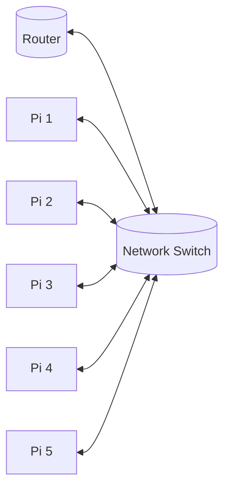

```mermaid
flowchart LR
  Router[(Router)]
  Switch[(Network Switch)]
  Pi1[Pi 1]
  Pi2[Pi 2]
  Pi3[Pi 3]
  Pi4[Pi 4]
  Pi5[Pi 5]

  Router <--> Switch
  Pi1 <--> Switch
  Pi2 <--> Switch
  Pi3 <--> Switch
  Pi4 <--> Switch
  Pi5 <--> Switch
```
